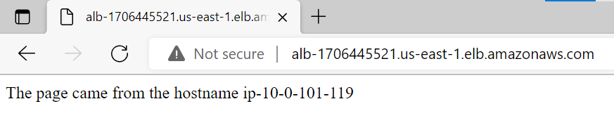

# Pact | Devops challenge

### **Challenge:**

Create a web page in a Nginx server alocated in AWS public segment. This web page just need show a simple message.

Create a checker script for health check. 

#### **Challenge Rules**:
- The web page need to be public (Internet Facing) (Required)
- Runing over NGINX web server (Required)
- Make documentation for each step
- Automate with CloudFormation (Optional)
- Use Configuration managemente tool (like Puppet, Chef or Ansible) (Optional)
- Load Balancer configuration (Optional)
- Run the NGINX server with docker system (Optional)

### **Prerequisites**:

* [Install Terraform](https://learn.hashicorp.com/tutorials/terraform/install-cli?in=terraform/aws-get-started)
* [Install AWS CLI](https://docs.aws.amazon.com/cli/latest/userguide/getting-started-install.html)
* AWS Account - It will provide by email to the requestor

### **Infrastructure design and execution:**

#### **Design** ####

Trying to cover the most of the required items, it was designed with the bellow configuration. I will describe in order from the frontend (internet) to the backend (nginx server):

- AWS internet gateway to point the inbound traffic to the VPC
- AWS VPC with two availability zones and two public subnets (assigned one per each zone)
- AWS ELB for Applications with a listener on 80 port and target group targeting to two AWS EC2 instances
- Two AWS EC2 instances with Ubuntu Server 20.04 (AMI for free tier offering). Each instace have a public ip address. This was configured with public ip only for the purpose of this challenge to access on each instace without a private vpn connection.
- Each instance have a ningx server running in docker container with a custom content. Just for the purpose of this challenge each instance shows the hostname that in this case is the private ip of each one.
- A security group to allow only the http and ssh connections

this configuration that is easy to create with the execution steps described in the next topic, have a special bash script that starts the instalation and configuration for the web server.

On the EC2 start, a script (makeserver.sh) is added. this script have each step to install and configure the docker system. Download the nginx image for docker, configuring ports and volumes to store the custome web content.

It script make a installation log on /var/log with the name of **infra_install.log** that we could check in two way:

1. Make a ssh conection to each EC2 instance and check specifically the log in the path mentioned on top.

2. Using the load balance dns provide in the finalization of the infrastructure configuration (check execution steps) and put the name of the log after the dns and it will be donwloaded (http://<load balancer dns\>/infra_install.log). Taking in count that donwloaded log is for a EC2 that response back the load balancer request.


#### **Execution** ####

In base of start to execute the infrastructure configuration is required first set the AWS credentials

To start the AWS credentials configurations run:

```bash
aws configure
```
The aws configuration will ask you enter bellow information:

- AWS Access Key ID - Acces Key ID downloaded from the user account
- AWS Secret Access Key - Secret key downloaded from the user account
- Default region name - For the purpose of this challenge it is recomended to use **es-east-1** region
- Default output format - For the purpose of this challenge it is recomended to use **json** format

```bash
AWS Access Key ID [None]:
AWS Secret Access Key [None]:
Default region name [None]:
Default output format [None]:
```
After this the next step is iniciate the terraform project. To do that is required execute the following steps:

```bash
cd ./IAC
terraform init
```
This command will iniciate the instalation of the terraform modules and the initialization of terraform backend. 

```text
Initializing modules...

Initializing the backend...

Initializing provider plugins...
- Reusing previous version of hashicorp/aws from the dependency lock file
- Using previously-installed hashicorp/aws v4.12.1

Terraform has been successfully initialized!

You may now begin working with Terraform. Try running "terraform plan" to see
any changes that are required for your infrastructure. All Terraform commands
should now work.

If you ever set or change modules or backend configuration for Terraform,
rerun this command to reinitialize your working directory. If you forget, other
commands will detect it and remind you to do so if necessary.
```
The previous message means that you are ready to start the Terraform deploy.

To start the deploy you need just run:

```bash
terraform plan
```
It command will check and make the deploy plan to build or update the requested infrastructure.

You wil see the commando output like this:

```bash
Terraform used the selected providers to generate the following execution plan. Resource actions are indicated with the following symbols:
  + create
 <= read (data resources)

Terraform will perform the following actions:

  # data.aws_instances.ec2_instances_ids will be read during apply
  # (config refers to values not yet known)
 <= data "aws_instances" "ec2_instances_ids"  {
      + id            = (known after apply)
      + ids           = (known after apply)
      + instance_tags = {
          + "Environment" = "dev"
        }
      + private_ips   = (known after apply)
      + public_ips    = (known after apply)
    }

  # data.aws_lb.alb will be read during apply
  # (config refers to values not yet known)
 <= data "aws_lb" "alb"  {
      + access_logs                = (known after apply)
      + arn                        = (known after apply)
      + arn_suffix                 = (known after apply)
      + customer_owned_ipv4_pool   = (known after apply)
      + desync_mitigation_mode     = (known after apply)
      + dns_name                   = (known after apply)
      + drop_invalid_header_fields = (known after apply)
      + enable_deletion_protection = (known after apply)
      + enable_http2               = (known after apply)
      + enable_waf_fail_open       = (known after apply)
      + id                         = (known after apply)
      + idle_timeout               = (known after apply)
      + internal                   = (known after apply)
      + ip_address_type            = (known after apply)
      + load_balancer_type         = (known after apply)
      + security_groups            = (known after apply)
      + subnet_mapping             = (known after apply)
      + subnets                    = (known after apply)
      + tags                       = (known after apply)
      + vpc_id                     = (known after apply)
      + zone_id                    = (known after apply)
    }
```

this show all the planed creations or modifications that terraform will make in our aws account.
Finaly you are ready to apply this configuration. To do that you just need to run this:

```bash
terraform apply
```
As the "plan" step, terraform apply will show the same information but with a litle difference that is a confirmation step:

```bash
Do you want to perform these actions?
Terraform will perform the actions described above.
Only 'yes' will be accepted to approve.

  Enter a value: yes
```
As the confirmation message said, you just need to enter "yes" word. Any other word written will cancel the execution.

Once it finish the execution you will see the finished status:

```bash
Apply complete! Resources: 26 added, 0 changed, 0 destroyed

Outputs:

albdns = "alb-1706445521.us-east-1.elb.amazonaws.com"
ec2_instance_ids = 2
```

Checking the finished status you could see the **albdns** that is the public dns for the application. puting it in a browser it will show the bellow information:



### **Checker Script**

#### **Design** ####

The watchdog scripts have a simple functionality. A simple execution of curl command with the check on the status of the response. The check is base on check the time out, the success and redirect, and finally if the execution not reach any site it will fail.
These scripts are ready for windows and linux systems.

When the scripts are executed these, will request to enter the url and the time between each curl execution.

In the execution the scripts not left logs in the machine or server that are executed. It is because these scripts are designed to be attached in some linux service or in the windows start. With that configuration in the operating system the script output could be redirect to a log for register each execution.

#### **Execution** ####

As a scripts these have a simple execution.

On **Linux** systems you need open a terminal console and if you have by default the **sh** command you can execute it in this way:

```bash
./watchdog.sh
```
and if you have by default other shell in your linux, you could execute in this way:

```bash
sh ./watchdog.sh
```

The execution will resquest to enter the url and the time between each curl

```bash
### Running Watchdog ###
Enter url to check
alb-1706445521.us-east-1.elb.amazonaws.com
Enter time to wait between check (in seconds)
5
```

If the url is reachable (http response: 200 or 301) the message will be:

```bash
**********************************************************
Status code: 200
Request success
**********************************************************
**********************************************************
Status code: 301
Request success
**********************************************************
```
For time out, the displayed code is the curl return code:

```bash
**********************************************************
Status code: 28 - time out
Request failed
**********************************************************
```
and finaly if the url are not reacheble the execution will show:

```bash
**********************************************************
Status code: 404
Request failed
**********************************************************
```